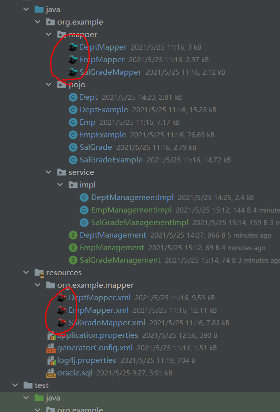

# MyBatis学习笔记

MyBatis是一款持久化框架。


这里参考[博客](https://blog.csdn.net/feiyangtianyao/article/details/93476407) 引入了`mybatis-proxy`框架，这是作者自己写的开源项目，用起来虽然没那么舒适，但也还OK。

Pojo、Mapper、mapper.xml均由`mybatis-generator-maven-plugin`插件自动生成，基于Example和Criteria的编码更为简单。

考虑到之前使用新版本MySQL8遇到的一些故障，更换MySQL版本为`5.7.26`。

IDEA已安装`mybatisx`插件。<br>


## Oracle自带的练习表
表结构说明：
```text
部门表
部门ID
部门名称
部门位置

员工表
员工ID
员工姓名
员工职位
员工领导ID
入职日期
员工薪水
员工奖金
员工部门

薪水表
最低薪水
最高薪水
```

建库建表SQL语句：
```sql
SET FOREIGN_KEY_CHECKS=0;

DROP DATABASE IF EXISTS oracle;
CREATE DATABASE oracle;
USE DATABASE oracle;

-- ----------------------------
-- Table structure for dept
-- ----------------------------
DROP TABLE IF EXISTS `dept`;
CREATE TABLE `dept` (
  `deptno` int(2) NOT NULL,
  `dname` varchar(14) DEFAULT NULL,
  `loc` varchar(13) DEFAULT NULL,
  PRIMARY KEY (`deptno`)
) ENGINE=InnoDB DEFAULT CHARSET=utf8;

-- ----------------------------
-- Records of dept
-- ----------------------------
INSERT INTO `dept` VALUES ('10', 'ACCOUNTING', 'NEW YORK');
INSERT INTO `dept` VALUES ('20', 'RESEARCH', 'DALLAS');
INSERT INTO `dept` VALUES ('30', 'SALES', 'CHICAGO');
INSERT INTO `dept` VALUES ('40', 'OPERATIONS', 'BOSTON');

-- ----------------------------
-- Table structure for emp
-- ----------------------------
DROP TABLE IF EXISTS `emp`;
CREATE TABLE `emp` (
  `empno` int(4) NOT NULL,
  `ename` varchar(10) DEFAULT NULL,
  `job` varchar(9) DEFAULT NULL,
  `mgr` int(4) DEFAULT NULL,
  `hiredate` date DEFAULT NULL,
  `sal` float(7,2) DEFAULT NULL,
  `comm` float(7,2) DEFAULT NULL,
  `deptno` int(2) DEFAULT NULL,
  PRIMARY KEY (`empno`),
  KEY `fk_deptno` (`deptno`),
  CONSTRAINT `fk_deptno` FOREIGN KEY (`deptno`) REFERENCES `dept` (`deptno`)
) ENGINE=InnoDB DEFAULT CHARSET=utf8;

-- ----------------------------
-- Records of emp
-- ----------------------------
INSERT INTO `emp` VALUES ('7369', 'SMITH', 'CLERK', '7902', '1980-12-17', '800.00', null, '20');
INSERT INTO `emp` VALUES ('7499', 'ALLEN', 'SALESMAN', '7698', '1981-02-20', '1600.00', '300.00', '30');
INSERT INTO `emp` VALUES ('7521', 'WARD', 'SALESMAN', '7698', '1981-02-22', '1250.00', '500.00', '30');
INSERT INTO `emp` VALUES ('7566', 'JONES', 'MANAGER', '7839', '1981-04-02', '2975.00', null, '20');
INSERT INTO `emp` VALUES ('7654', 'MARTIN', 'SALESMAN', '7698', '1981-09-28', '1250.00', '1400.00', '30');
INSERT INTO `emp` VALUES ('7698', 'BLAKE', 'MANAGER', '7839', '1981-05-01', '2850.00', null, '30');
INSERT INTO `emp` VALUES ('7782', 'CLARK', 'MANAGER', '7839', '1981-06-09', '2450.00', null, '10');
INSERT INTO `emp` VALUES ('7788', 'SCOTT', 'ANALYST', '7566', '1987-07-13', '3000.00', null, '20');
INSERT INTO `emp` VALUES ('7839', 'KING', 'PRESIDENT', null, '1981-11-07', '5000.00', null, '10');
INSERT INTO `emp` VALUES ('7844', 'TURNER', 'SALESMAN', '7698', '1981-09-08', '1500.00', '0.00', '30');
INSERT INTO `emp` VALUES ('7876', 'ADAMS', 'CLERK', '7788', '1987-07-13', '1100.00', null, '20');
INSERT INTO `emp` VALUES ('7900', 'JAMES', 'CLERK', '7698', '1981-12-03', '950.00', null, '30');
INSERT INTO `emp` VALUES ('7902', 'FORD', 'ANALYST', '7566', '1981-12-03', '3000.00', null, '20');
INSERT INTO `emp` VALUES ('7934', 'MILLER', 'CLERK', '7782', '1982-01-23', '1300.00', null, '10');

-- ----------------------------
-- Table structure for salgrade
-- ----------------------------
DROP TABLE IF EXISTS `salgrade`;
CREATE TABLE `salgrade` (
  `grade` int(11) DEFAULT NULL,
  `losal` int(11) DEFAULT NULL,
  `hisal` int(11) DEFAULT NULL
) ENGINE=InnoDB DEFAULT CHARSET=utf8;

-- ----------------------------
-- Records of salgrade
-- ----------------------------
INSERT INTO `salgrade` VALUES ('1', '700', '1200');
INSERT INTO `salgrade` VALUES ('2', '1201', '1400');
INSERT INTO `salgrade` VALUES ('3', '1401', '2000');
INSERT INTO `salgrade` VALUES ('4', '2001', '3000');
INSERT INTO `salgrade` VALUES ('5', '3001', '9999');
```
